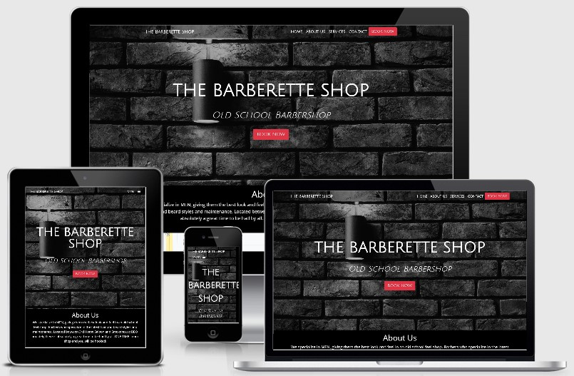

# **The Barberette Shop Website**
## Table of Contents
1. [Description](#description)
2. [Wireframes](#wireframes)
3. [Deployment](#deployment)
4. [UX](#ux)
5. [User Stories](#stories)
6. [Features](#features)
   - Existing Features
   - Removed Features
   - Future Features/Scalability
7. [Testing](#testing)
8. [Technologies/Tools Used](#tools)
   - Languages and Frameworks
   - Tools
9. [Credit](#credit)
   - Content
   - Media
   - Acknowledgements

## **Description**
This is the static website for a real barbershop located in Elkhart, Indiana.

The purpose of this website is to provide current and potential customers all the information about The Barberette Shop needed to book an appointment, such as services provided with images for examples, pricing, shop location, and 'buttons' that allow customers the convenience of scheduling an appointment online.

The pages of this website are as follows:
- **Home:** A landing page where a call-to-action "Book Now" button is immediately available for reasons discussed in depth later. There is also a short introduction to the barbershop and a map showing it's location.
- **Services:** Provides information about the services offered, with prices and images included. 
- **Contact:** A page with a contact form for customers with any questions and another map showing the location.

[*Table of Contents*](#top)

## **Wireframes**
Wireframes were created for mobile, tablet, and laptop sized screens. Links to each are below:
- [Mobile Wireframe](assets/wireframes/barberette_wire_mobile.pdf)
- [Tablet Wireframe](assets/wireframes/barberette_wire_tablet.pdf)
- [Laptop Wireframe](assets/wireframes/barberette_wire_largescreen.pdf)

[*Table of Contents*](#top)

## **Deployment**
The Barberette Shop website has been deployed to github pages and can be accessed [HERE](https://samlud1110.github.io/milestone_one/).

[*Table of Contents*](#top)

## **UX**

[*Table of Contents*](#top)

## **User Stories**
At this stage of development, three groups of people have been identified as users of this website: Current clients, prospective clients, and the business owner. 

[*Table of Contents*](#top)

## **Features**
  ### Existing Features
  ### Removed Features
  ### Future Features/Scalability

[*Table of Contents*](#top)

## **Testing**
- HTML Validation: https://validator.w3.org/#validate_by_input 
- CSS Validation: https://jigsaw.w3.org/css-validator/#validate_by_input 
- Website speed testing: https://tools.pingdom.com/ 

[*Table of Contents*](#top)

## **Technologies/Tools Used**
  ### Languages and Frameworks
  - HTML
  - CSS
  - Bootstrap
  ### Tools Used
  - Balsamiq: Used for large screen wireframe. 
  - Visual Studio Code: IDE
  - Icons - https://fontawesome.com/?from=io
  - Google Fonts - https://fonts.google.com/
  - CSS autoprefixer: https://autoprefixer.github.io/
  - Image editing: https://pinetools.com/c-images/
  - Favicon generator: https://favicon.io/favicon-converter/

[*Table of Contents*](#top)

## **Credits**
  ### Content
  The text used throughout the website was taken from The Barberette Shop's existing online sources including [Facebook](https://www.facebook.com/thebarberetteshop), [Vagaro](https://www.vagaro.com/thebarberetteshop), and [Yelp](https://www.yelp.com/biz/the-barberette-shop-elkhart) with some minor edits.
  ### Media
  Images used for this website were found at the following locations:
  - https://www.facebook.com/thebarberetteshop/photos/?ref=page_internal
  - https://www.yelp.com/biz_photos/the-barberette-shop-elkhart 
  - https://www.vagaro.com/thebarberetteshop 
  - https://www.pexels.com/ 
    - Brick background image on the landing page - https://www.pexels.com/photo/brick-brickwall-brickwork-cement-276514/ 
    - x
  - http://ami.responsivedesign.is/

  ### Acknowledgements
  - Navbar code modeled after the navbar found at https://blackrockdigital.github.io/startbootstrap-agency/
  - .hvr-grow-shadow code found at https://ianlunn.github.io/Hover/#effects
  - Footer - code from UCD-resume project used as a starting point for the footer.

[*Table of Contents*](#top)

Milestone Project #1
The Barberette Shop Website

https://samlud1110.github.io/milestone_one/

Sources of inspiration.
  - https://getbootstrap.com/ 
  - http://chivalrygroomingparlour.com/
  - https://startbootstrap.com/ 
  - https://code-institute-solutions.github.io/StudentExampleProjectGradeFive/index.html 
   
  
Image Sources
  1. https://www.facebook.com/thebarberetteshop/photos/?ref=page_internal
  2. https://www.yelp.com/biz_photos/the-barberette-shop-elkhart 
  3. https://www.vagaro.com/thebarberetteshop 
  4. https://www.pexels.com/ 
    - Brick background image on the landing page - https://www.pexels.com/photo/brick-brickwall-brickwork-cement-276514/ 
    - x
  5. http://ami.responsivedesign.is/

Testing
  - CSS linting: csslint.net
  - HTML Validation: https://validator.w3.org/#validate_by_input 
  - CSS Validation: https://jigsaw.w3.org/css-validator/#validate_by_input 
  - Website speed testing: 
  - CSS autoprefixer:

Fonts - https://fonts.google.com/ 

Icons - https://fontawesome.com/?from=io 

Other Tools Used
 1. Image editing: https://pinetools.com/c-images/
 2. Favicon generator: https://favicon.io/favicon-converter/
 3. 

 