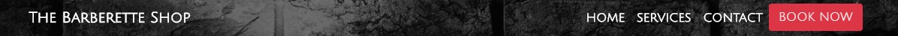
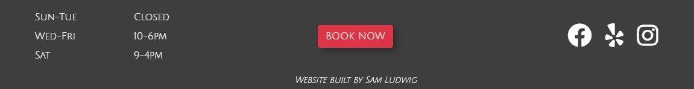

# **The Barberette Shop Website**
## Table of Contents
1. [Description](#description)
2. [Wireframes](#wireframes)
3. [Deployment](#deployment)
4. [UX](#ux)
5. [User Stories](#stories)
6. [Features](#features)
   - [Existing Features](#existing)
   - [Removed Features](#removed)
   - [Future Features/Scalability](#future)
7. [Testing](#testing)
8. [Technologies/Tools Used](#tech)
   - [Languages and Frameworks](#languages)
   - [Tools](#tools)
9. [Credit](#credit)
   - [Content](#content)
   - [Media](#media)
   - [Acknowledgements](#thanks)

## **Description**
This is the static website for a real barbershop located in Elkhart, Indiana.

The purpose of this website is to provide current and potential customers all the information about The Barberette Shop needed to book an appointment, such as services provided with images for examples, pricing, shop location, business hours, and buttons that allow customers the convenience of easily scheduling an appointment online.

The pages of this website are as follows:
- [**Home:**](https://samlud1110.github.io/milestone_one/) A very inviting landing page where a call-to-action "Book Now" button is immediately available for reasons discussed in depth later. There is also a short introduction to The Barberette Shop and a map showing it's location.
- [**Services:**](https://samlud1110.github.io/milestone_one/services.html) Provides information about the services offered, with prices and images included. 
- [**Contact:**](https://samlud1110.github.io/milestone_one/contact.html) A page with a contact form for customers with any questions and another map showing the location.

[*Table of Contents*](#top)

## **Wireframes**
Wireframes were created for mobile, tablet, and laptop sized screens. Links to each are below:
- [Mobile Wireframe](assets/wireframes/barberette_wire_mobile.pdf)
- [Tablet Wireframe](assets/wireframes/barberette_wire_tablet.pdf)
- [Laptop Wireframe](assets/wireframes/barberette_wire_largescreen.pdf)

[*Table of Contents*](#top)

## **Deployment**
The Barberette Shop website has been deployed to github pages and can be accessed here: [The Barberette Shop](https://samlud1110.github.io/milestone_one/)

Upon final approval from the business owner, this site will be deployed at TheBarberetteShop.com. 

[*Table of Contents*](#top)

## **UX**

A review of the physical barbershop was the starting point when working on brand and visual identity for The Barberette Shop website. The physical location has a rugged, "old school" yet clean and simple look and feel. Matching that aesthetic was the goal for this website. In addition to simply matching the brand and visual identity of the physical location, the target audience was considered when deciding on the color scheme, fonts, etc.. In order to appeal to the target audience (men who work hard but care about how they look) while maintaining fidelity to The Barberette Shop brand the following choices were made.

 - A color scheme consisting of blacks and greys appeals to the target audience while also providing the "old school" feel.
 - White text contrasts nicely with the color scheme. 
 - The "call to action" areas are red and draw the eyes immediately. 

 The navbar and footer illustrate how these UI elements contribute nicely to the overall user experience.

 

 

[*Table of Contents*](#top)

## **User Stories**
At this stage of development, three groups of people have been identified as users of this website: Current clients, prospective clients, and the business owner. 

[*Table of Contents*](#top)

## **Features**

  

  [*Table of Contents*](#top)
  ### Existing Features

  

  [*Table of Contents*](#top)
  ### Removed Features

  

  [*Table of Contents*](#top)
  ### Future Features/Scalability

[*Table of Contents*](#top)

## **Testing**
- HTML Validation: https://validator.w3.org/#validate_by_input 
- CSS Validation: https://jigsaw.w3.org/css-validator/#validate_by_input 
- Website speed testing: https://tools.pingdom.com/ 

[*Table of Contents*](#top)

## **Technologies/Tools Used**
  

  ### Languages and Frameworks
  - HTML
  - CSS
  - Bootstrap

  [*Table of Contents*](#top)
  

  ### Tools Used
  - Balsamiq: Used for large screen wireframe. 
  - Visual Studio Code: IDE
  - Icons - https://fontawesome.com/?from=io
  - Google Fonts - https://fonts.google.com/
  - CSS autoprefixer: https://autoprefixer.github.io/
  - Image editing: https://pinetools.com/c-images/
  - Favicon generator: https://favicon.io/favicon-converter/
  - Color Contrast Accessibility Validator: https://color.a11y.com/Contrast/

[*Table of Contents*](#top)

## **Credits**
  

  ### Content
  The text used throughout the website was taken from The Barberette Shop's existing online sources including [Facebook](https://www.facebook.com/thebarberetteshop), [Vagaro](https://www.vagaro.com/thebarberetteshop), and [Yelp](https://www.yelp.com/biz/the-barberette-shop-elkhart) with some minor edits.

  [*Table of Contents*](#top)
  

  ### Media
  Images used for this website were found at the following locations:
  - https://www.facebook.com/thebarberetteshop/photos/?ref=page_internal
  - https://www.yelp.com/biz_photos/the-barberette-shop-elkhart 
  - https://www.vagaro.com/thebarberetteshop 
  - https://www.pexels.com/ 
    - Brick background image on the landing page - https://www.pexels.com/photo/brick-brickwall-brickwork-cement-276514/ 
    - x
  - http://ami.responsivedesign.is/

  [*Table of Contents*](#top)
  

  ### Acknowledgements
  - Navbar code modeled after the navbar found at https://blackrockdigital.github.io/startbootstrap-agency/
  - .hvr-grow-shadow code found at https://ianlunn.github.io/Hover/#effects
  - Footer - code from UCD-resume project used as a starting point for the footer.
  
  Sources of inspiration.
  - https://getbootstrap.com/ 
  - http://chivalrygroomingparlour.com/
  - https://startbootstrap.com/ 
  - https://code-institute-solutions.github.io/StudentExampleProjectGradeFive/index.html 

[*Table of Contents*](#top)
