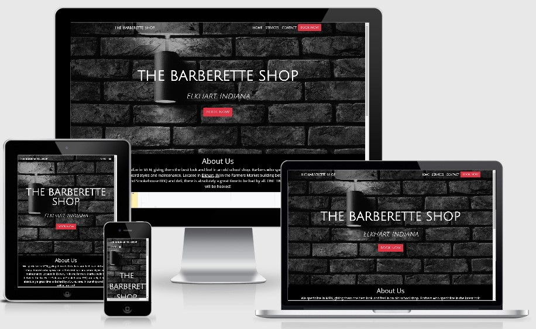

# **The Barberette Shop Website**
## Table of Contents
1. [Description](#description)
2. [Wireframes](#wireframes)
3. [Deployment](#deployment)
4. [UX](#ux)
5. [User Stories](#stories)
6. [Features](#features)
   - [Existing Features](#existing)
   - [Future Features/Scalability](#future)
7. [Testing](#testing)
8. [Technologies/Tools Used](#tech)
   - [Languages and Frameworks](#languages)
   - [Tools](#tools)
9. [Credit](#credit)
   - [Content](#content)
   - [Media](#media)
   - [Acknowledgements](#thanks)

## **Description**
This is the static website for a real barbershop located in Elkhart, Indiana.

The purpose of this website is to provide current and potential customers all the information about The Barberette Shop needed to book an appointment, such as services provided with images for examples, pricing, shop location, business hours, and buttons that allow customers the convenience of easily scheduling an appointment online.

The pages of this website are as follows:
- [**Home:**](https://samlud1110.github.io/milestone_one/) A very inviting landing page where a call-to-action "Book Now" button is immediately available. There is also a short introduction to The Barberette Shop and a map showing it's location.
- [**Services:**](https://samlud1110.github.io/milestone_one/services.html) Provides information about the services offered, with prices and images included. 
- [**Contact:**](https://samlud1110.github.io/milestone_one/contact.html) A page with a contact form for customers with any questions and another map showing the location.

[*Table of Contents*](#top)

## **Wireframes**
Wireframes were created for mobile, tablet, and laptop sized screens. Links to each are below:
- [Mobile Wireframe](assets/wireframes/barberette_wire_mobile.pdf)
- [Tablet Wireframe](assets/wireframes/barberette_wire_tablet.pdf)
- [Laptop Wireframe](assets/wireframes/barberette_wire_largescreen.pdf)

[*Table of Contents*](#top)

## **Deployment**
The Barberette Shop website has been deployed to github pages and can be accessed here: [The Barberette Shop](https://samlud1110.github.io/milestone_one/)

Upon final approval from the business owner, this site will be deployed at TheBarberetteShop.com. 

[*Table of Contents*](#top)

## **UX**

A review of the physical barbershop was the starting point when working on brand and visual identity for The Barberette Shop website. The physical location has a rugged, "old school" yet clean and simple look and feel. Matching that aesthetic was the goal for this website. In addition to simply matching the brand and visual identity of the physical location, the target audience was considered when deciding on the color scheme, fonts, etc.. In order to appeal to the target audience (men who work hard but care about how they look) while maintaining fidelity to The Barberette Shop brand the following choices were made.

 - A color scheme consisting of blacks and greys appeals to the target audience while also providing the "old school" feel.
 - White text contrasts nicely with the color scheme. 
 - The "call to action" areas are red and draw the eyes immediately. 

 The navbar and footer (shown below) illustrate how these UI elements contribute nicely to the overall user experience.

 

 

Furthermore, all aspects of the website were made to be as simple as possible. Text was minimized and images were highlighted due to the very visual nature of hair and barber services. The services page in particular exemplifies this simplicity in a responsive manner. 

[Services page on all devices](assets/images/services_devices.pdf)

[*Table of Contents*](#top)

## **User Stories**
At this stage of development, two main groups of people have been identified as users of this website: clients and the business owner. 

Clients
- As a client, I want a simple way to schedule appointments online.
- As a client, I want to see the services available with example images.
- As a client, I want to know the prices for the services offered.
- As a client, I want to see the hours of operation.
- As a client, I want to see the location of the barbershop on a map.
- As a client, I want to send a message to the business owner easily.
- As a client, I want to connect to this business on social media.

Business Owner
- As the business owner, I want to show clients the services I offer.
- As the business owner, I want to show clients where my business is located.
- As the business owner, I want to receive personal messages from my clients.
- As the business owner, I want to tell people about my business.
- As the business owner, I want to connect with people on social media.

[*Table of Contents*](#top)

## **Features**

  

  [*Table of Contents*](#top)
  ### Existing Features
  The various features on the site are:
  - The navbar remains at the top of the window.
  - All features are responsive utilizing Bootstrap.
  - Bootstrap cards are used on the services page.

  

  [*Table of Contents*](#top)
  ### Future Features/Scalability
  Features to be added in the future:
  - A seperate page devoted to images of happy clients.
  - Building the backend elements necessary to schedule appointments online while on this site as opposed to sending clients to a third party service.
  - Adding a page devoted to ecommerce so clients can purchase products online. 

[*Table of Contents*](#top)

## **Testing**
The following resources were used to test this site:
- [HTML Validation](https://validator.w3.org/#validate_by_input)
- [CSS Validation](https://jigsaw.w3.org/css-validator/#validate_by_input)
- Website speed testing using [Pingdom](https://tools.pingdom.com/)
- [Color Contrast Accessibility Validator](https://color.a11y.com/Contrast/)
- DevTools in Google Chrome.

[*Table of Contents*](#top)

## **Technologies/Tools Used**
  

  ### Languages and Frameworks
  - HTML
  - CSS
  - Bootstrap

  [*Table of Contents*](#top)
  

  ### Tools Used
  - Balsamiq: Used for large screen wireframe and the frames for the small and medium screens. 
  - Visual Studio Code: IDE
  - [Bootstrap](https://getbootstrap.com/) framework
  - [Font Awesome](https://fontawesome.com/?from=io) used for social media icons
  - [Google Fonts](https://fonts.google.com/)
  - [CSS autoprefixer](https://autoprefixer.github.io/) to help cross browser compatibility
  - [Image editing](https://pinetools.com/c-images/)
  - [Favicon generator](https://favicon.io/favicon-converter/)
  - [Color Contrast Accessibility Validator](https://color.a11y.com/Contrast/)
  - DevTools in Google Chrome

[*Table of Contents*](#top)

## **Credits**
  

  ### Content
  The text used throughout the website was taken from The Barberette Shop's existing online sources including [Facebook](https://www.facebook.com/thebarberetteshop), [Vagaro](https://www.vagaro.com/thebarberetteshop), and [Yelp](https://www.yelp.com/biz/the-barberette-shop-elkhart) with some minor edits.

  [*Table of Contents*](#top)
  

  ### Media
  Images used for this website were found at the following locations:
  - [The Barberette Shop Facebook](https://www.facebook.com/thebarberetteshop/photos/?ref=page_internal)
  - [The Barberette Shop Yelp](https://www.yelp.com/biz_photos/the-barberette-shop-elkhart)
  - [Vagaro](https://www.vagaro.com/thebarberetteshop)
  - [Pexels.com](https://www.pexels.com/)
  - [Am I Responsive](http://ami.responsivedesign.is/)

  [*Table of Contents*](#top)
  

  ### Acknowledgements
  - Navbar code modeled after the navbar found [HERE](https://blackrockdigital.github.io/startbootstrap-agency/)
  - .hvr-grow-shadow code found [HERE](https://ianlunn.github.io/Hover/#effects)
  - Footer code from UCD-resume project used as a starting point for the footer.
  - A big thank you to the slack community and my mentor.
  
  Sources of inspiration.
  - [Bootstrap](https://getbootstrap.com/)
  - [Chivalry Grooming Parlour](http://chivalrygroomingparlour.com/)
  - [StartBootstrap.com](https://startbootstrap.com/)
  - [Code Institute Grade 5 Example Project](https://code-institute-solutions.github.io/StudentExampleProjectGradeFive/index.html)

[*Table of Contents*](#top)
